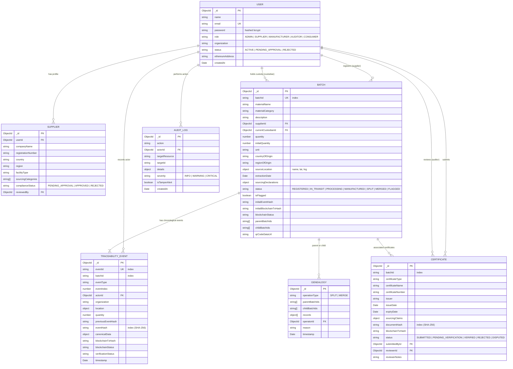

# Database Entity-Relationship & Schema Specification

The application uses MongoDB via Mongoose with normalized references for audit integrity and cryptographic indexing.

```mermaid
erDiagram
    USER ||--o{ SUPPLIER : "has profile"
    USER ||--o{ BATCH : "registers (supplier)"
    USER ||--o{ BATCH : "holds custody (custodian)"
    USER ||--o{ TRACEABILITY_EVENT : "records actor"
    USER ||--o{ CERTIFICATE : "submits"
    USER ||--o{ CERTIFICATE : "reviews (auditor)"
    USER ||--o{ AUDIT_LOG : "performs action"

    BATCH ||--|{ TRACEABILITY_EVENT : "has chronological events"
    BATCH ||--o{ CERTIFICATE : "associated certificates"
    BATCH ||--o{ GENEALOGY : "parent or child"

    USER {
        ObjectId _id PK
        string name
        string email UK
        string password "hashed bcrypt"
        string role "ADMIN | SUPPLIER | MANUFACTURER | AUDITOR | CONSUMER"
        string organization
        string status "ACTIVE | PENDING_APPROVAL | REJECTED"
        string ethereumAddress
        Date createdAt
    }

    SUPPLIER {
        ObjectId _id PK
        ObjectId userId FK
        string companyName
        string registrationNumber
        string country
        string region
        string facilityType
        string[] sourcingCategories
        string complianceStatus "PENDING_APPROVAL | APPROVED | REJECTED"
        ObjectId reviewedBy FK
    }

    BATCH {
        ObjectId _id PK
        string batchId UK "index"
        string materialName
        string materialCategory
        string description
        ObjectId supplierId FK
        ObjectId currentCustodianId FK
        number quantity
        number initialQuantity
        string unit
        string countryOfOrigin
        string regionOfOrigin
        object sourceLocation "name, lat, lng"
        Date extractionDate
        object sourcingDeclarations
        string status "REGISTERED | IN_TRANSIT | PROCESSING | MANUFACTURED | SPLIT | MERGED | FLAGGED"
        boolean isFlagged
        string initialEventHash
        string initialBlockchainTxHash
        string blockchainStatus
        string[] parentBatchIds
        string[] childBatchIds
        string qrCodeDataUrl
    }

    TRACEABILITY_EVENT {
        ObjectId _id PK
        string eventId UK "index"
        string batchId "index"
        string eventType
        number eventIndex
        ObjectId actorId FK
        string organization
        object location
        number quantity
        string previousEventHash
        string eventHash "index (SHA-256)"
        object canonicalData
        string blockchainTxHash
        string blockchainStatus
        string verificationStatus
        Date timestamp
    }

    CERTIFICATE {
        ObjectId _id PK
        string batchId "index"
        string certificateType
        string certificateName
        string certificateNumber
        string issuer
        Date issueDate
        Date expiryDate
        object sourcingClaims
        string documentHash "index (SHA-256)"
        string blockchainTxHash
        string status "SUBMITTED | PENDING_VERIFICATION | VERIFIED | REJECTED | DISPUTED"
        ObjectId submittedById FK
        ObjectId reviewerId FK
        string reviewerNotes
    }

    GENEALOGY {
        ObjectId _id PK
        string operationType "SPLIT | MERGE"
        string[] parentBatchIds
        string[] childBatchIds
        object[] records
        ObjectId operatorId FK
        string reason
        Date timestamp
    }

    AUDIT_LOG {
        ObjectId _id PK
        string action
        ObjectId actorId FK
        string targetResource
        string targetId
        object details
        string severity "INFO | WARNING | CRITICAL"
        boolean isTamperAlert
        Date createdAt
    }
```
